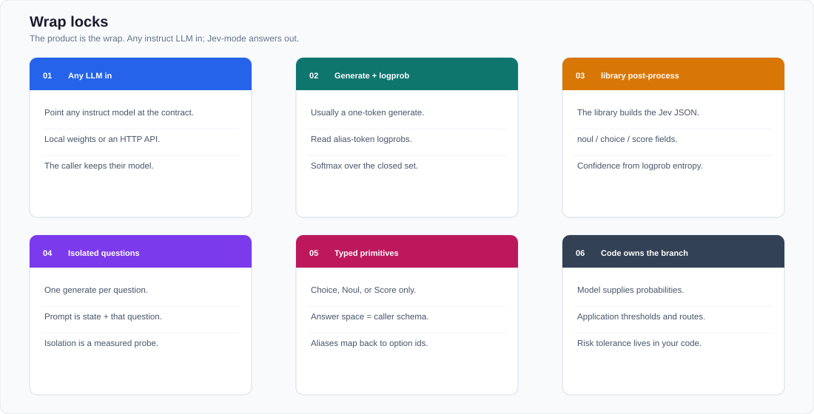

# jev-any-llm — Design

> Design v1.1 · wrap any instruct LLM into Jev-mode  
> Canonical figures: [docs/figures/architecture.svg](docs/figures/architecture.svg) · [docs/figures/characteristics.svg](docs/figures/characteristics.svg)

## Aim

TypeSafe Jev (2026) is a System One call: **unstructured program state + typed questions → structured probabilistic answers**, with independent judgments.

This work seeks to **turn an arbitrary open instruct LLM into that prediction mode**, then **cut the generate-bound latency** of that wrap.

**Phase 1 — wrap (contract on any LLM)**

1. One **generate** per question (isolated prompt: `state` + that question).
2. **Logprobs** on a closed alias set (`A`/`B`/`C`, `Yes`/`No`, `0`..`K-1`).
3. **Post-process** in jev-any-llm: softmax, then fill `noul` / `choice` / `score` / `confidence`.

A wrap call with *N* questions is *N* short generates. That is still slow for software that wants Jev-like 100ms-class decisions. **Phases 2–3 are in scope to fix that:** replace the LM head with Choice / Noul / Score heads and score every question in **one forward pass**. Calibration training (Brier / this work’s `jev-any-llm-rlcd` recipe) rides on that same path.

Out of scope: TypeSafe’s unpublished weights and internal RLCD recipe; chat / prose generation.

## Status and document map

Program one-liner: **Phase 1 wrap library landed; latency benchmark complete;
native single-forward (Phases 2–3) still planned.**

| Hub | Path |
| --- | --- |
| Reading entry | [README.md](README.md) |
| Usage (backends / env / serve) | [docs/USAGE.md](docs/USAGE.md) |
| This design | [DESIGN.md](DESIGN.md) |
| Conversion protocol | [experiments/jev_mode_benchmark/PROTOCOL.md](experiments/jev_mode_benchmark/PROTOCOL.md) |
| Benchmark report | [experiments/jev_mode_benchmark/REPORT.md](experiments/jev_mode_benchmark/REPORT.md) (hub) · [4B](experiments/jev_mode_benchmark/REPORT_qwen35_4b.md) · [27B](experiments/jev_mode_benchmark/REPORT_qwen38_27b.md) · [Flash](experiments/jev_mode_benchmark/REPORT_deepseek_v41_flash.md) |
| Figures | [docs/figures/](docs/figures/) |
| Field survey | [docs/notes/jev-15-builds.md](docs/notes/jev-15-builds.md) |

| Phase | Status | Design | Config | Artifacts |
| --- | --- | --- | --- | --- |
| 0 · Contract + wrap locks | **This document** | this file | — | [architecture.svg](docs/figures/architecture.svg), [characteristics.svg](docs/figures/characteristics.svg) |
| 1 · Wrap (contract) | **Landed** | [§ Wrap path](#wrap-path-phase-1) | env `JEV_ANY_LLM_*` | `src/jev_any_llm/`, `tests/test_contract.py`, `tests/test_branched.py` |
| 2 · Native heads (latency) | Planned | [§ Native backend](#native-backend-phases-2-3) | `configs/native.yaml` (later) | LoRA / head checkpoints |
| 3 · Single-forward (latency) | Planned | [§ Inference](#inference) | same | latency / questions-per-second cards |
| Latency benchmark | **Complete** | [protocol](experiments/jev_mode_benchmark/PROTOCOL.md) | benchmark scripts | [hub report](experiments/jev_mode_benchmark/REPORT.md) + per-model scorecards · [shared-prefill report](experiments/jev_mode_benchmark/REPORT_branched.md) |
| Eval harness | Planned | [§ Evaluation](#evaluation) | `configs/eval.yaml` (later) | Brier, ECE, isolation probe |

## Key characteristics

These six locks **are** the wrap tool. A change that breaks a lock is a different project.



*Figure: the six wrap locks. Short labels only; each lock is specified below.*

### 1. Typed primitives are the only answers

Every question is one of three types. Every answer is a value inside the schema the caller sent.

| Type | Question | Required fields | Answer |
| --- | --- | --- | --- |
| **Noul** | Does this condition hold? | `instructions`; optional `criteria.true` / `criteria.false` | `noul` ∈ [0, 1] = P(yes) |
| **Choice** | Which of these options? | `instructions` + `criteria` map (unordered) | `choice` (argmax), `probabilities`, `confidence` |
| **Score** | Where on this ordered scale? | `instructions` + `criteria` list (ordered, 2–10 levels) | `score` = E[level], `legend`, `probabilities`, `confidence` |

The wire format is the typed answer object only (`noul` / `choice` / `score` plus the distribution). A successful response is JSON that type-checks against the request. Schema errors and wrong decisions are separate problems: the first is a transport failure; the second is an eval failure.

Question IDs are for application code. The model sees `instructions` and `criteria` only. Write the full question in `instructions` even when the ID looks obvious.

### 2. Independent judgments

A request may carry many questions against one `state`. Each question is a separate judgment. Questions share the state encoding. Each answer is computed from that encoding and that question alone.

This lock is enforced in the backend and in the isolation probe:

| Backend | How isolation is implemented |
| --- | --- |
| Wrap path | One judgment per question. Default prompt is `state` + that question only. `mode="branched"` prefills `state` once and continues each question from that cache. |
| Native (Phases 2–3) | Shared backbone over `state`; per-question heads with no answer-to-answer attention. |

The eval harness includes an **isolation probe**: pairs of questions where a leaked answer from Q1 would change Q2’s gold. Leakage is a failed probe, even if accuracy on each question in isolation is high.

Packing several questions into one prompt so the model can “see the whole case” is a different API. jev-any-llm's public `decide()` call keeps judgments independent. If a later question must condition on an earlier answer, the application runs a second request and puts the first answer into `state` itself.

### 3. Wrap path: generate + logprob + post-process


*Figure: wrap pipeline. The model predicts option aliases. jev-any-llm assembles the Jev `answers` object.*

```python
from jev_any_llm import Client, noul, choice, score

client = Client(model="Qwen/Qwen2.5-7B-Instruct")  # any instruct LLM with logprobs
result = client.decide(state=..., questions=...)
```

The Jev JSON on the wire is **jev-any-llm post-processing** of option logprobs. Grammar-constrained JSON (`xgrammar` / `outlines` forcing `{"choice": ...}`) is an optional adapter for APIs that cannot return logprobs; it is out of the default Phase 1 path.

| Capability | Wrap path (Phase 1) |
| --- | --- |
| Public primitives | Choice / Noul / Score |
| Model job | Next-token predict an alias (`A`/`Yes`/`2`) |
| Probability source | Alias-token logprobs, softmax over the closed set |
| Confidence | Concentration of that distribution (`1 − H(p) / log K`) |
| Multi-question | N independent judgments. Default: N isolated generates. Optional: one shared `state` prefill, then a per-question suffix (`mode="branched"`). |
| HTTP JSON | Assembled by jev-any-llm after the generate |

### 4. Calibration is the primary metric

System One quality is whether **stated probabilities match observed frequencies**. Accuracy is reported. The gates that decide “this checkpoint is better” are calibration gates.

| Metric | Role |
| --- | --- |
| **Brier score** | Primary. Mean squared error between p and the outcome. Lower is better. |
| **ECE** (15-bin, equal-width unless noted) | Primary companion. Gap between confidence and accuracy per bin. |
| **Reliability diagram** | Required figure on every eval artifact. |
| Accuracy / argmax hit-rate | Secondary card. |
| **answers type-check** | Transport card. Wrap path constructs the object in code. Log `logprobs=missing` fallbacks. |
| Isolation-probe leak rate | Contract card. Target is 0 on the wrap path. |

Wrap-path probabilities are the base model’s next-token softmax over the alias set. This work logs Brier / ECE on that distribution so the wrap is measurable. Native-head training (Phases 2–3) minimizes Brier / log loss against labeled events ([§ Native backend](#native-backend-phases-2-3)).

A model that is 70% accurate with ECE 0.04 is a better System One checkpoint here than a model that is 74% accurate with ECE 0.18.

### 5. Score is ordinal

`Score.criteria` is an ordered list. Level `i` is strictly higher on that one dimension than level `i-1`. The returned `score` is the probability-weighted mean of level indices:

```text
score = Σ_i  i · p(i)
```

It may land between levels. `probabilities` is the full distribution; `confidence` is a concentration statistic (this work uses normalized inverse entropy: `1 − H(p) / log K`). A score of 1.0 with all mass on level 1 and a score of 1.0 with mass split between 0 and 2 are different objects; the distribution and confidence tell them apart.

Native training uses an **ordinal / cumulative-logit** head (CORN or proportional-odds). Independent per-level binary heads are an ablation arm, recorded as such, because they drop the order constraint.

Keep each Score to **one dimension**. Split “punctual and experienced” into two Score questions and combine in application code.

Choice criteria are an unordered set. Rank belongs on Score. Noul is a binary event; degree questions belong on Score.

### 6. Application code owns the branch

jev-any-llm is a probabilistic `if`. The model returns `noul` / `choice` / `score`. Thresholds, fallbacks, and side effects live in the caller.

```python
if answers["refund"].noul > 0.8 and answers["team"].choice == "billing":
    if answers["urgency"].score >= 1.5:
        escalate(ticket)
    else:
        queue_billing(ticket)
elif answers["team"].confidence < 0.5:
    route_to_human(ticket)
```

Risk tolerance is a number in your code. This work ships example thresholds in cookbooks only. Production floors are measured on your labels (plot confidence vs accuracy, then move the floor).

## Public contract

Compatible with the public System One request shape (TypeSafe Jev / OpenRouter Decisions): `state` + named `questions` → `answers` keyed by the same ids.

### Request

```json
{
  "model": "jev-any-llm",
  "state": {
    "message": "Charged twice for order A-104. I want a refund today.",
    "order": {"id": "A-104", "charges": [49, 49]}
  },
  "questions": {
    "refund": {
      "type": "noul",
      "instructions": "Does `message` ask for money back?",
      "criteria": {
        "true": "Explicit refund or chargeback request",
        "false": "No money-back request"
      }
    },
    "team": {
      "type": "choice",
      "instructions": "Which team should handle `message`?",
      "criteria": {
        "billing": "Charges, invoices, refunds",
        "technical": "Bugs, outages, integrations",
        "other": "None of the above"
      }
    },
    "urgency": {
      "type": "score",
      "instructions": "How time-sensitive is `message`?",
      "criteria": [
        "No deadline or consequence",
        "Wants a reply this week",
        "Asks for action today or cites ongoing loss"
      ]
    }
  }
}
```

Limits (aligned with the public Jev contract so clients can swap endpoints):

| Limit | Value |
| --- | --- |
| Choice cardinality | 2–255 options |
| Score levels | 2–10 |
| State | string, object, or array of text |
| Modalities | text in v1 |

### Response

```json
{
  "model": "jev-any-llm",
  "answers": {
    "refund": {"type": "noul", "noul": 0.93},
    "team": {
      "type": "choice",
      "choice": "billing",
      "probabilities": {"billing": 0.84, "technical": 0.15, "other": 0.01},
      "confidence": 0.61
    },
    "urgency": {
      "type": "score",
      "score": 1.7,
      "legend": {
        "0": "No deadline or consequence",
        "1": "Wants a reply this week",
        "2": "Asks for action today or cites ongoing loss"
      },
      "probabilities": {"0": 0.05, "1": 0.20, "2": 0.75},
      "confidence": 0.52
    }
  },
  "usage": {"input_tokens": 180, "output_tokens": 0, "backend": "schema"}
}
```

Noul has no separate `confidence` field. `noul` itself is the uncertainty signal (near 0.5 = both sides similar).

`confidence` for Choice / Score in this work:

```text
confidence = 1 - H(p) / log(K)
```

Callers who need another statistic compute it from `probabilities`. The full distribution is always returned.

### Python helpers

```python
noul(instructions, true=None, false=None)
choice(instructions, criteria: dict[str, str])
score(instructions, criteria: list[str])
```

### HTTP

```text
POST /v1/systemone
GET  /v1/models
```

`/v1/systemone` is the compatibility path. A jev-any-llm-native alias `POST /v1/decide` may exist; it is the same body.

## Wrap path (Phase 1)

Goal: point jev-any-llm at any instruct LLM (or OpenAI-compatible generate with logprobs) and get the contract above.

Pipeline per question:

1. Render `state` (JSON, compact) + that question’s `instructions` and `criteria`.
2. Bind the closed set to **short aliases** so the next token is the class:
   - Noul → `Yes` / `No`
   - Choice → `A`, `B`, `C`, … one letter per option (criteria text stays in the prompt as the legend)
   - Score → `0` .. `K-1` in order
3. **Generate** (typically `max_tokens=1`) with logprobs enabled. Read logprob of each alias token (and common variants: ` Yes` with a leading space, `yes` / `YES`, etc.).
4. Keep only those aliases, **softmax**, get `p(alias)`.
5. **Post-process in jev-any-llm** (the model has already finished):
   - Noul: `noul = p(Yes)`
   - Choice: map alias → option id; `choice = argmax`; `confidence = 1 − H(p) / log K`
   - Score: `score = Σ i · p(i)`; same confidence formula; attach `legend`
6. Return. Sibling questions stay independent. The default is a separate generate per question. `mode="branched"` prefills `state` once, forks that cache, and reads each question’s alias logits from its own suffix. Alias strings must resolve to one vocab id. OpenAI-compatible servers stay on isolated generates. Measured arms: [REPORT_branched.md](experiments/jev_mode_benchmark/REPORT_branched.md).

Recommended stack for the first prototype: **vLLM or Hugging Face generate with `logprobs`**, Qwen2.5-Instruct as the smoke model. One process. Batch questions of the same request as independent sequences.

If an endpoint cannot return logprobs, a fallback adapter may ask for a single alias token and parse it, with a degenerate one-hot `probabilities`. That fallback is logged as `logprobs=missing`.

Known properties of this path, measured on the smoke suite:

- Latency follows one short generate per question (prefix cache on `state` helps).
- Calibration is the base model’s next-token softmax over the alias set, until a later native/calibration stage.
- Schema validity of `answers` is jev-any-llm's job: the object is constructed in code.

Phase 1 is done when: (a) the three primitives round-trip, (b) a multi-question request matches N isolated single-question requests within sampling noise, (c) `answers` always type-checks, (d) Brier / ECE are logged from the logprob distributions (no calibration gate yet).

## Native backend (Phases 2–3)

Goal: **same `decide()` contract, lower latency.** Wrap pays one generate per question. This path keeps the backbone, attaches Choice / Noul / Score heads, and scores every question in **one forward pass**. Calibration (Brier / `jev-any-llm-rlcd`) is trained on those heads.

### Model

- Start from an open instruct or encoder checkpoint (first candidate: a mid-size Qwen decoder or a ModernBERT / DeBERTa encoder for short-context routing).
- Keep the backbone (freeze or LoRA).
- Drop the generative LM head for this path.
- Attach:

| Head | Input | Output |
| --- | --- | --- |
| Noul | pooled state × question text | logit → P(yes) |
| Choice | pooled state × (question + option i) | score per option → softmax |
| Score | pooled state × (question + level i), with ordinal structure | cumulative logits → p(level) |

Choice with variable option sets is a **set classifier** (score each option independently, softmax over the request’s set), so cardinality can vary per call.

### Data

Each row is: `state`, one typed question, and a **target event**.

| Label kind | Allowed use |
| --- | --- |
| Public gold (human or dataset label) | Training + eval |
| Teacher model probabilities | Distillation only; stored as `teacher`, never as `gold` |
| Live TypeSafe / other API dumps | Research traces; `gold_status: unresolved` until independently labeled |

Construct targets as probabilities of events. For Noul, the target is 0/1 or a calibrated teacher p. For Choice, a one-hot or a teacher distribution over the given options. For Score, a level index or a teacher distribution over levels.

### Losses

| Head | Default loss |
| --- | --- |
| Noul | Binary Brier + BCE |
| Choice | Multiclass Brier + CE over the request’s option set |
| Score | CORN / cumulative logit; Brier on the implied p(level) |

Accuracy-only fine-tuning is an ablation.

### RLCD-style stage

TypeSafe’s RLCD is unpublished. This work’s stand-in, named **`jev-any-llm-rlcd` in configs**, is:

1. Supervised calibration on gold events (Brier / log loss).
2. Optional policy-gradient or DPO-style step where the reward is **negative Brier / ECE on a held-out outcome batch**, with a KL tether to the supervised head.

The config records the exact reward. Checkpoints are compared on held-out Brier / ECE. TypeSafe RLCD is unpublished; `jev-any-llm-rlcd` is the recipe in this file.

### Inference

Phase 3 is the latency cut: **one backbone forward on `state`**, then all question heads in parallel. Prefix / radix cache on `state` is in scope.

Latency cards report end-to-end `decide()` time and questions per second at batch 1 and batch 8. The wrap-path card (N short generates) is the baseline those numbers beat.

## Evaluation

Every checkpoint writes a directory:

```text
artifacts/eval/<run_id>/
  summary.json          # Brier, ECE, accuracy, validity, isolation leak
  reliability.svg       # calibration curve
  per_primitive.json    # Noul / Choice / Score split
  isolation_probe.json
```

Default public tasks (convenient, small, labeled):

| Primitive | Seed task | Why |
| --- | --- | --- |
| Noul | binary NLI / toxicity / “does the user ask for X” slices | p(yes) is directly Brier-able |
| Choice | topic / intent classification with an `other` bucket | variable-K softmax |
| Score | ordered sentiment / severity (2–5 levels) | ordinal vs independent-class ablation |

Isolation probe: two Noul questions A and B on one state, constructed so that the gold for B flips if the model is shown A’s answer. Leak rate = fraction of B flips under that contamination. Wrap-path target: 0.

Gates are Brier, ECE, isolation leak, and answers type-check. MMLU, BLEU, and chat-arena scores measure a different object and are out of scope as gates.

## Repository layout (target)

```text
jev-any-llm/
  README.md
  DESIGN.md
  src/jev_any_llm/
    api.py              # Client, noul, choice, score
    contract.py         # request / response types + validation
    wrap.py             # Phase 1: generate + logprob + post-process
    native.py           # Phases 2-3: heads + single forward (latency)
    serve.py            # POST /v1/systemone
  configs/
  scripts/              # train, eval, render figures
  tests/                # contract, isolation, ordinal score math
  docs/figures/
  artifacts/            # gitignored eval dumps
```

Phase 1 lands `api.py`, `contract.py`, `wrap.py`, `serve.py`, and contract tests. Native modules stay stubs.

## Related work

| Work | Relation to this repo |
| --- | --- |
| TypeSafe Jev | Public System One contract this work speaks. Independent implementation. |
| kotoba-lang / OpenJev-DeBERTa | Encoder, one-forward typed decisions. Closest native-path prior. |
| ekzhang/openjev-sglang | Logit readout over an instruct model via SGLang. Closest wrap/logit-path prior. |
| openjev.com | Browser demo of option-logit vs JSON generation. |
| Week-one Made with Jev catalog (15-build survey) | Field split: LLM generates, Jev-mode judges, code executes. Notes: [jev-15-builds.md](docs/notes/jev-15-builds.md). |

jev-any-llm's jobs are the **wrap** (any instruct LLM → Jev-mode via generate + logprob) and the **latency path** (one forward, all questions). Closest wrap prior: openjev-sglang / openjev.com logit readout. Closest latency prior: OpenJev-DeBERTa one-forward heads.

## Out of scope

- TypeSafe’s unpublished weights, internal RLCD recipe, and private workflow-eval Pareto *numbers*.
- Forcing the wrapped model to emit API JSON via a grammar as the default Phase 1 path.
- Generating replies, summaries, code, or chain-of-thought.
- Images / audio as `state` in v1.
- Treating teacher-model dumps as gold labels.
- Training on un-audited preference pairs where both sides can be the wrong event (see calibration data rules above).
