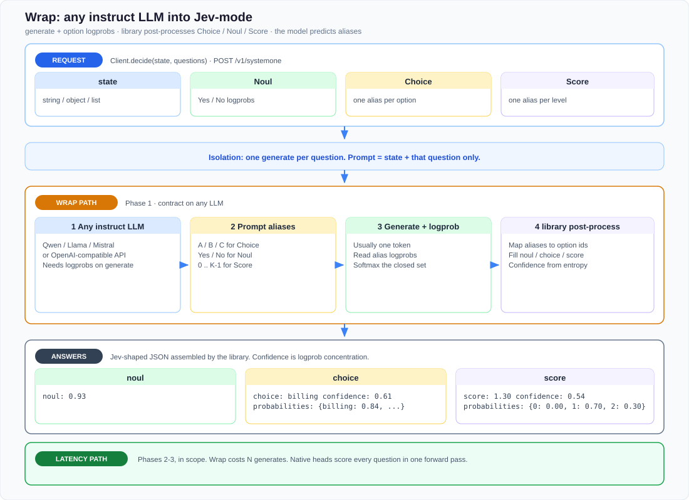
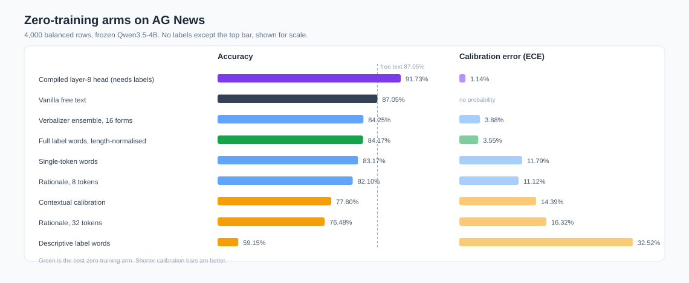
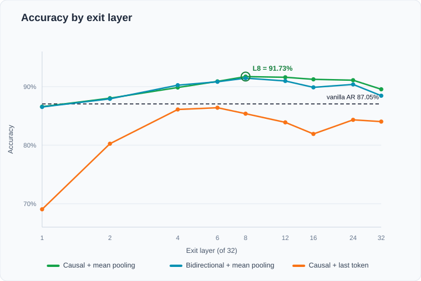

# jev-any-llm

**Wrap any instruct LLM into Jev-mode prediction — and make those decisions SUPER fast.**

Point any OpenAI-compatible API (or local HF weights) at typed questions
(`Choice` / `Noul` / `Score`) over **program state**. The library scores closed
options from logprobs (or early-exit mean-pool heads) and returns a Jev-shaped
`answers` object your code can branch on. On AG News, that path lands
**~15–88×** faster than the same model’s free-text baseline — see [Results](#results).

| Decoder | Vanilla | L8 mean | Speedup | Δ Acc |
| --- | ---: | ---: | ---: | ---: |
| Qwen3.5-4B | 87.05% / 511 ms | **91.73%** / **12.0 ms** | **42.5×** | +4.7 pp |
| Qwen3.8-27B | 87.0% / 1105 ms | **91.07%** / **12.6 ms** | **87.7×** | +4.1 pp |
| DeepSeek-V4.1-Flash | 64.63% / 4440 ms | **91.62%** / **299 ms** | **14.9×** | +27 pp |

Full scorecards: [benchmark report](experiments/jev_mode_benchmark/REPORT.md) ·

## Motivation

The destination for this repo is a **Jev-mode interface on any decoder LLM**:
typed `Choice` / `Noul` / `Score` answers that downstream code can use to
decide and branch — while **keeping the model’s useful capability** and, when
possible, **leaving weights untouched**.

Moving from next-token chat to Jev-mode changes what “performance” even means,
so exact metric parity with free-text decode is a hard evaluation target. The
bar this work aims for is: **preserve capability, stay compatible with
Jev-shaped decision apps**.

Near-term work uses **approximate adapters** (logprob wrap, early-exit heads,
…) so today’s instruct models already speak that contract. Those adapters are
scaffolding on the path; the product shape above is the goal.

## Quick start

```bash
pip install -e '.[dev]'
```

```python
from jev_any_llm import Client, noul, choice, score

client = Client.from_openai(
    model="Qwen/Qwen2.5-7B-Instruct",
    base_url="http://127.0.0.1:8000/v1",
    api_key="EMPTY",
)

result = client.decide(
    state={"message": "Charged twice for order A-104. I want a refund today."},
    questions={
        "refund": noul("Does `message` ask for money back?"),
        "team": choice(
            "Which team should handle `message`?",
            {
                "billing": "Charges, invoices, refunds",
                "technical": "Bugs, outages, integrations",
                "other": "None of the above",
            },
        ),
        "urgency": score(
            "How time-sensitive is `message`?",
            [
                "No deadline or consequence",
                "Wants a reply this week",
                "Asks for action today or cites ongoing loss",
            ],
        ),
    },
)

if result.answers["refund"].noul > 0.8:
    route_billing(result.answers["urgency"].score)
```

More backends (vLLM / SGLang / hosted OpenAI-compat / HF), env vars, and
`jev-any-llm-serve`: **[docs/USAGE.md](docs/USAGE.md)**.

## How it works



1. **Plug in a model** — OpenAI-compatible `chat/completions` with `logprobs`, or local HF weights.
2. **Isolate questions** — each prompt is `state` + that question only.
3. **Score closed options** — alias tokens (`A`/`B`, `Yes`/`No`, `0`..`K-1`) → softmax.
4. **Your code branches** — the library fills `noul` / `choice` / `score` / `confidence`.

Phase 1 is this wrap. Phases 2–3 keep the same `decide()` and move scoring into
native heads / one forward pass — see [DESIGN.md](DESIGN.md).

## Results

[AG News](https://huggingface.co/datasets/ag_news) (4,000 rows; Zhang et al.,
[arXiv:1509.01626](https://arxiv.org/abs/1509.01626)). Speedups vs that model’s
own free-text baseline.



*Figure: frozen Qwen3.5-4B. Purple bar is the compiled **L8 mean** head (needs
labels). Everything below is zero-training wrap — usable, but none beat vanilla
accuracy. That gap is why the latency path trains a tiny head.*

**Why it’s fast:** Vanilla spends time on full-depth decode of many free-text
tokens. **L8 mean** stops at layer 8, mean-pools the hidden state, and scores
the closed option set with a tiny head — one short forward, no long generate.

Early exit is **one** measured lever. The same `decide()` path also gets faster
by scoring closed options (one-token / logprob wrap instead of long free text),
by swapping in **native Choice / Noul / Score heads**, and by scoring every
question in **one backbone forward** (Phases 2–3) — see [DESIGN.md](DESIGN.md).

Depth probe (same weights, where accuracy peaks):



*Figure: exit layer (of 32) vs accuracy — curves peak at layer 8, then deeper
layers weigh down classification.*

| Decoder | Vanilla | L8 mean | Speedup | Δ Acc |
| --- | ---: | ---: | ---: | ---: |
| Qwen3.5-4B | 87.05% / 511 ms | **91.73%** / **12.0 ms** | **42.5×** | +4.7 pp |
| Qwen3.8-27B | 87.0% / 1105 ms | **91.07%** / **12.6 ms** | **87.7×** | +4.1 pp |
| DeepSeek-V4.1-Flash | 64.63% / 4440 ms | **91.62%** / **299 ms** | **14.9×** | +27 pp |

Full scorecards: [benchmark report](experiments/jev_mode_benchmark/REPORT.md) ·
[4B](experiments/jev_mode_benchmark/REPORT_qwen35_4b.md) ·
[27B](experiments/jev_mode_benchmark/REPORT_qwen38_27b.md) ·
[Flash](experiments/jev_mode_benchmark/REPORT_deepseek_v41_flash.md).


