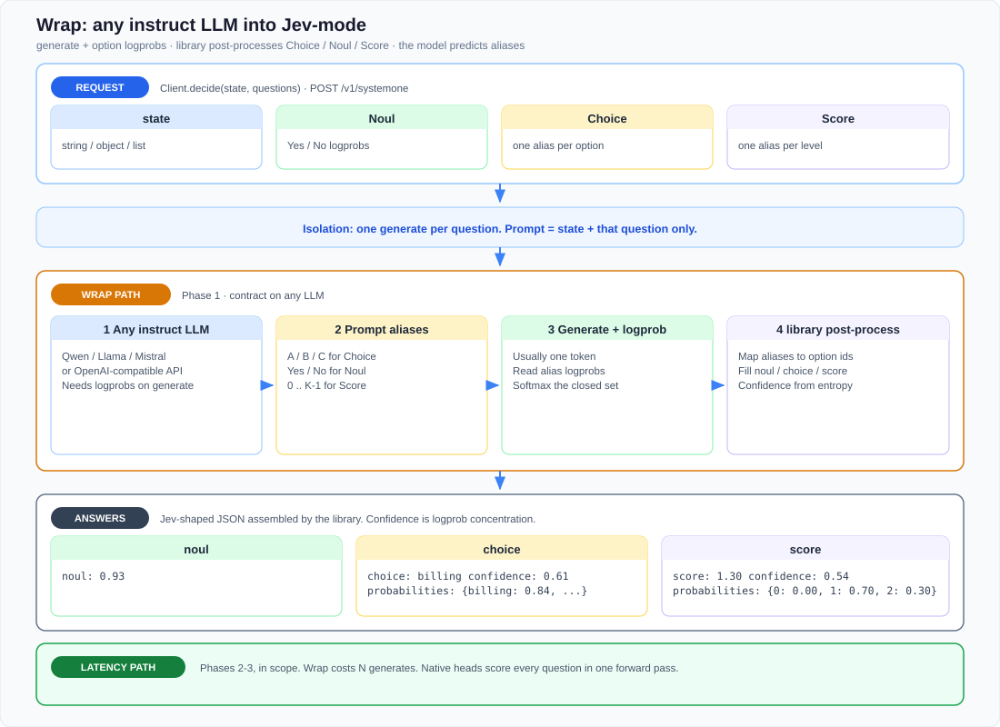
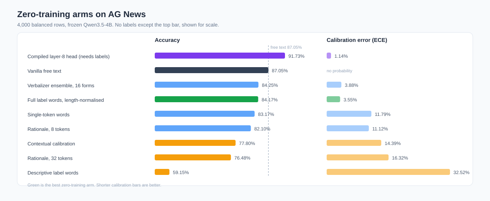
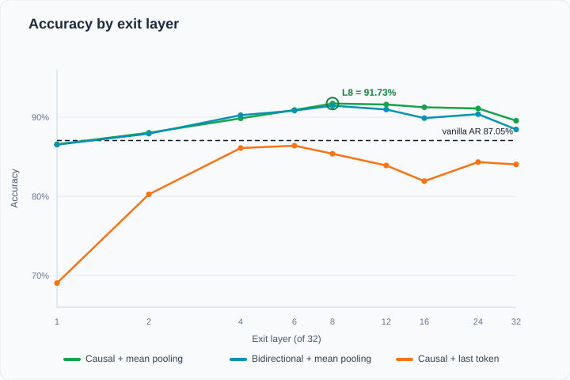

[Usage](docs/USAGE.md) · [Design](DESIGN.md) · [Benchmarks](experiments/jev_mode_benchmark/REPORT.md) · [Protocol](experiments/jev_mode_benchmark/PROTOCOL.md)

[](pyproject.toml)
[](pyproject.toml)
[](experiments/jev_mode_benchmark/REPORT.md)
[](LICENSE)

---

## What is jev-any-llm?

jev-any-llm is a Jev-mode interface on any instruct decoder: program state in, typed probabilistic answers out, so application code can branch. It keeps the model's useful capability and stays compatible with Jev-shaped decision apps.

It does two jobs.

### Structured output

Pass in the program state and a list of questions. Each answer is one of three kinds.

| Kind | Question | Answer | Closed set |
| --- | --- | --- | --- |
| Yes / no | Does this hold? | Probability of yes, from 0 to 1 | Yes, No |
| Choice | Which option? | Winning option, and how peaked that distribution is | A through Z |
| Score | Where on this scale? | Expected level on a scale of 2–10, possibly between two levels | 0, 1, … |

Field names are under [Names](#names).

### Faster decisions

On AG News, a closed-set readout is about **10–12×** faster than each dense model's own free-text baseline, and about **2.3×** on DeepSeek-V4.1-Flash.

Branched mode scores several questions from one shared prefix. At about 2000 tokens it is the fastest multi-question path, about **2.3–3.3×** versus asking them one after another.

A layer-8 mean-pool head on the same frozen weights is about **15–88×**. Figures are in [Results](#results).

**Contents**

- [Structured output](#structured-output) · [Faster decisions](#faster-decisions)
- [Quick start](#quick-start)
- [How it works](#how-it-works)
- [Results](#results)
- [Names](#names)

---

## Quick start

```bash
pip install -e '.[dev]'
```

Branched mode, the playground, and hosted-Jev notes:
[docs/USAGE.md](docs/USAGE.md).

```python
from jev_any_llm import Client, noul, choice, score

client = Client.from_openai(
    model="Qwen/Qwen2.5-7B-Instruct",
    base_url="http://127.0.0.1:8000/v1",
    api_key="EMPTY",
)

result = client.decide(
    state={"message": "Charged twice for order A-104. I want a refund today."},
    questions={
        "refund": noul("Does `message` ask for money back?"),
        "team": choice(
            "Which team should handle `message`?",
            {
                "billing": "Charges, invoices, refunds",
                "technical": "Bugs, outages, integrations",
                "other": "None of the above",
            },
        ),
        "urgency": score(
            "How time-sensitive is `message`?",
            [
                "No deadline or consequence",
                "Wants a reply this week",
                "Asks for action today or cites ongoing loss",
            ],
        ),
    },
)

if result.answers["refund"].noul > 0.8:
    route_billing(result.answers["urgency"].score)
```

More backends (vLLM / SGLang / hosted OpenAI-compat / HF), env vars, and
the jev-any-llm-serve command: **[docs/USAGE.md](docs/USAGE.md)**.

## How it works



1. **Plug in a model.** An OpenAI-compatible chat API that returns log probabilities, or local weights.
2. **Isolate questions.** Each prompt is the state plus that question. Branched mode prefills the state once and scores every question suffix from that cache. A hosted chat API keeps a separate generate per question.
3. **Score the closed set.** Softmax over the tokens in the table above.
4. **Branch in your code.** The response carries the yes-probability, the chosen option, or the expected score, plus how peaked the distribution is.

Phase 1 is this wrap. Later phases keep the same call and move scoring into native heads. See [DESIGN.md](DESIGN.md).

## Results

[AG News](https://huggingface.co/datasets/ag_news) (4,000 rows; Zhang et al.,
[arXiv:1509.01626](https://arxiv.org/abs/1509.01626)). Speedups vs that model’s
own free-text baseline.

<table>
<tr><th>Decoder</th><th>Vanilla</th><th>L8 mean</th><th>Speedup</th><th>Δ Acc</th></tr>
<tr><td>Qwen3.5-4B</td><td>87.05% / 511 ms</td><td><b>91.73%</b> / <b>12.0 ms</b></td><td><b>42.5×</b></td><td>+4.7 pp</td></tr>
<tr><td>Qwen3.8-27B</td><td>87.0% / 1105 ms</td><td><b>91.07%</b> / <b>12.6 ms</b></td><td><b>87.7×</b></td><td>+4.1 pp</td></tr>
<tr><td>DeepSeek-V4.1-Flash</td><td>64.63% / 4440 ms</td><td><b>91.62%</b> / <b>299 ms</b></td><td><b>14.9×</b></td><td>+27 pp</td></tr>
<tr><td colspan="5"><b>KV-share + branch</b> — 4 judgments, CUDA-event p50. Parentheses are versus sequential isolated. Bold is the fastest arm on that row.</td></tr>
<tr><th>Decoder</th><th>Prefix</th><th>Isolated ×4</th><th>Branched</th><th>Isolated batch</th></tr>
<tr><td>Qwen3.5-4B</td><td>short</td><td>247 ms</td><td>172 ms (1.44×)</td><td><b>104 ms (2.37×)</b></td></tr>
<tr><td>Qwen3.5-4B</td><td>2057</td><td>783 ms</td><td><b>274 ms (2.86×)</b></td><td>706 ms (1.11×)</td></tr>
<tr><td>Qwen3.8-27B</td><td>short</td><td>468 ms</td><td>374 ms (1.25×)</td><td><b>378 ms (1.24×)</b></td></tr>
<tr><td>Qwen3.8-27B</td><td>2057</td><td>3.70 s</td><td><b>1.13 s (3.28×)</b></td><td>3.69 s (1.00×)</td></tr>
<tr><td>DeepSeek-V4.1-Flash</td><td>87</td><td>7.89 s</td><td>4.51 s (1.75×)</td><td><b>2.98 s (2.65×)</b></td></tr>
<tr><td>DeepSeek-V4.1-Flash</td><td>2082</td><td>17.43 s</td><td><b>7.42 s (2.35×)</b></td><td>12.78 s (1.36×)</td></tr>
</table>



*Figure: frozen Qwen3.5-4B. Purple bar is the compiled **L8 mean** head (needs
labels). Everything below is zero-training wrap — usable, but none beat vanilla
accuracy. That gap is why the latency path trains a tiny head.*

**Why it’s fast.** Free-text decode runs the full stack across many tokens. The wrap reads one closed-set position. Branched mode prefills a long shared prefix once. The layer-8 mean-pool head stops that stack early and is the 12–299 ms column above.

Depth probe (same weights, where accuracy peaks):



*Figure: exit layer (of 32) vs accuracy — curves peak at layer 8, then deeper
layers weigh down classification.*

Branched mode is the schedule for **complex reasoning** and **agent calls**
that fan one long state out into several candidates: tree-of-thought traces,
best-of-N, search, or several next actions scored against the same history.
Streaming chat, where the next token is still unknown, stays on autoregressive
decode. Full arms: [REPORT_branched.md](experiments/jev_mode_benchmark/REPORT_branched.md).

Full scorecards: [benchmark report](experiments/jev_mode_benchmark/REPORT.md) ·
[4B](experiments/jev_mode_benchmark/REPORT_qwen35_4b.md) ·
[27B](experiments/jev_mode_benchmark/REPORT_qwen38_27b.md) ·
[Flash](experiments/jev_mode_benchmark/REPORT_deepseek_v41_flash.md) ·
[branched](experiments/jev_mode_benchmark/REPORT_branched.md) ·
[typed heads](experiments/jev_mode_benchmark/REPORT_typed_heads.md) ·
[early branch](experiments/jev_mode_benchmark/REPORT_early_branch.md).

## Names

Names in the code and on the wire.

| Name | Means |
| --- | --- |
| decide | The Python call. The same JSON body is POST /v1/systemone and POST /v1/decide. |
| state | The program text or object that every question can see. |
| Noul | Yes-or-no. The noul field is the probability of yes. |
| Choice | One option among the ones you named. The choice field is the winner. The probabilities field holds one number per option. |
| Score | An ordered scale. The score field is the expected level. The legend field maps each level index to its text. |
| confidence | How peaked the distribution is: one minus its entropy, divided by the log of the number of options. |
| branched | Prefill the shared state once, fork the cache, and score each question suffix from that cache. |


## Citation

```bibtex
@misc{foosynaptic_jevanyllm,
  title={jev-any-llm: Adapter for JEV to connect any LLM backend},
  author={fooSynaptic},
  howpublished={https://github.com/fooSynaptic/jev-any-llm},
  year={2026},
  note={Accessed: 2026-09-29}
}

```

