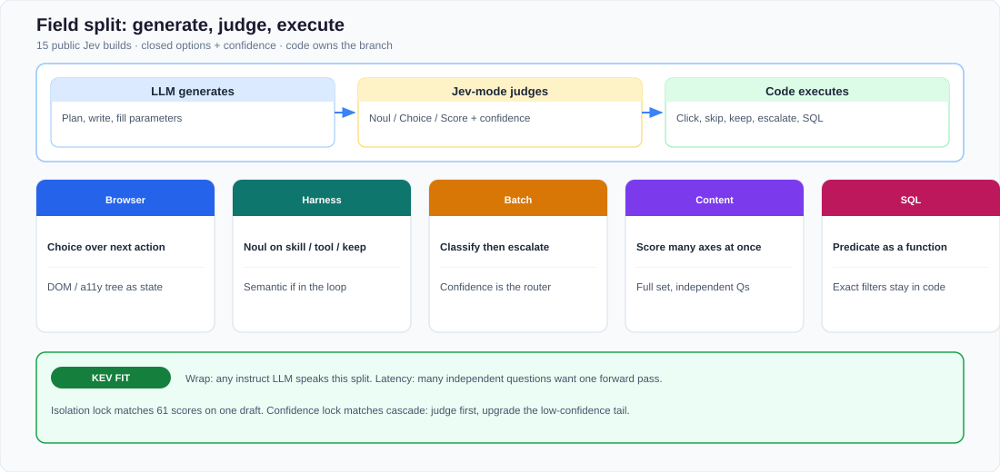

# Notes: 15 public Jev builds (week one)

- **Topic:** System One field survey / wrap contract
- **Source:** WeChat article, [mp.weixin.qq.com/s/pF0j0LdMvSHaeSN1hZPVvA](https://mp.weixin.qq.com/s/pF0j0LdMvSHaeSN1hZPVvA)
- **Original title:** Jev爆火一周，我扒了15个最值得看的实战项目!

I read this as a catalog of how people *call* a System One model in the first week after TypeSafe shipped Jev (2026-09-15). The article’s snapshot: **Made with Jev** listed **239** public builds by day 6 (2026-09-20); **102** of those published a cost, latency, or throughput number. I treat every dollar and millisecond below as **author-reported**, on mixed harnesses, unless the article names a named public benchmark.

This note extracts the *judgment pattern*. I leave the full product write-ups in the source post.

## What I took from it

The repeated recipe is a three-way split:

**LLM generates** (plan, prose, tool arguments) → **Jev-mode judges** (Noul / Choice / Score + confidence) → **code executes** (click, skip, keep, escalate, `WHERE`).

That split is already a jev-any-llm lock: the wrapped model only has to next-token-predict on a closed set; application code owns the branch. The field also shows *why* Phases 2–3 exist: these apps fire **many independent questions** (61 on one draft; 14 Noul per post × 100k posts). Wrap-time “one generate per question” is the contract. One forward pass is the latency path.

*Figure: five clusters from the 15-build survey. Closed options and confidence sit in the middle; code still clicks, skips, keeps, or escalates.*

Type-safe output means the answer lands in the schema the caller sent. Semantic correctness is a separate eval. The article’s own reminder: official Workflow Evals show Jev / Sol / Opus disagreeing with a **teacher aggregate** (GPT-6 Astra + Claude Fable 5.1). That aggregate is a reference label. Gold-event eval is a different object.

## Snapshot the article used

| Item | Figure |
| --- | --- |
| Jev ship date | 2026-09-15 |
| Catalog | Made with Jev, 239 public builds by day 6 |
| Builds with a published cost / speed / volume number | 102 |
| Official framing | Workflow Evals: structured judgments as their own model job |

Out of scope for this note: treating those 239 builds as a single leaderboard.

## 15 builds, as judgment jobs

I grouped the 15 the way the article did. Primitive is my mapping onto jev-any-llm's types.

### Browser: Choice over the next action

State is DOM or accessibility tree. Options are executable actions. A small LLM writes text only when the action is “type”.

| # | Build | Primitive | What Jev-mode answers | Author-reported card |
| --- | --- | --- | --- | --- |
| 1 | Jev Ultrafast (Browser Use) | Choice | Next click / scroll / back from current DOM | Full flight-search demo ~7 s, ~$0.004 |
| 2 | Jev + WebMCP | Choice | Which site-exposed tool | Public WebMCP bench 49/49; Jev-only Ultrafast harness 25/49; author: ~1/112 the model-inference cost of a GPT-6 Astra + Computer Use + Code Execution stack on that bench |
| 3 | Stagehand | Choice | Next action from a11y tree | Remote-browser demo ~$0.001 |
| 4 | Jev Browser Use | Choice | Navigate / click / toggle / scroll | EZCollegeApp: ~5–10× faster browser ops. Codex keeps typing, vision, sensitive ops, final verify |

Pattern I keep: **candidate space first**. WebMCP winning 49/49 after collapsing multi-click chores into one named tool is a Choice-quality story.

### Harness: Noul as a semantic `if`

| # | Build | Primitive | What Jev-mode answers | Author-reported card |
| --- | --- | --- | --- | --- |
| 5 | fast-jev-compaction | Noul | Keep this tool call / result as **verbatim** text? | Compaction as filter. A later Codex port’s README flags it as experimental: probability-trim can break the host compaction path and bust prompt cache |
| 6 | jev-skill-gate | Noul (or Choice) | Is this skill relevant to the incoming prompt? | 217 skills: manifest 12,750 → 3,185 tokens (~75%); ~$0.0009 / session |
| 7 | pi-warden | Noul | Irreversible? Off-task? Looping? Declaring done without test/build/lint evidence? | Author self-test: 150 paired runs, 6 rule violations vs 0; 13,952 guard cases / 109 cycles |
| 8 | jev-shield | Noul | Allow this tool description / call / result into the agent? | Author: 94% block recall, 0 false positives, ~$0.00002 / check |

Pattern I keep: Skill / context / tool permission are **harness** questions. Hard allow-lists stay; a typed judgment sits in front of them.

### Batch: classify, then escalate on confidence

| # | Build | Primitive | What Jev-mode answers | Author-reported card |
| --- | --- | --- | --- | --- |
| 9 | 1kpapers | Choice | Which of 24 topics? DeepSeek V4 Flash writes the summary first | 1,018 papers: Jev classify ~$0.08, median 256 ms/paper; summaries $3.99. Author still running eval before replacing the live taxonomy |
| 10 | 500-email classify | Choice | Mail bucket | 500 mails ~$0.035; a follow-up on 1,500 mails |
| 11 | Jev + Kimi K3 fraud mail | Noul + cascade | Fraud? If confidence &lt; 95%, upgrade | 100 mails (50/50): Jev 1.42 s on all 100; 31 upgraded; combo 96/100 in ~16 s, ~$0.07 ($0.068 Kimi, ~$0.003 Jev) |

Pattern I keep: **confidence is the router**. Cheap closed-set first; expensive generate on the tail. That is jev-any-llm lock 6 with a numeric threshold.

### Content: Score many independent axes

| # | Build | Primitive | What Jev-mode answers | Author-reported card |
| --- | --- | --- | --- | --- |
| 12 | Matthew Berman, 724 ads | Score / Choice | Hook, format, offer, CTA, awareness, landing mismatch, … | 724 ads / 37 brands ~40 s, ~$0.09 |
| 13 | SuperX | Mix, 61 Qs / draft | Hook, density, reply-bait, spread, … | ~1 s / draft, ~$0.0004; fit on 9,481 posts / 207 creators. Also cited: 3,282 posts × 8 Qs ~$0.1282; 100k posts × 14 Noul in 20.4 s, $0.67 |
| 14 | YouTube Sponsor Skipper | Noul | Is the playhead in a sponsor segment? | Chrome ext; ~$0.005 / video; code skips |

Pattern I keep: isolation. Sixty-one questions on one draft is the jev-any-llm multi-question call: shared `state`, separate judgments.

### SQL: a semantic predicate next to exact filters

| # | Build | Primitive | What Jev-mode answers | Author-reported card |
| --- | --- | --- | --- | --- |
| 15 | pg-jev | Noul / Choice | `jev(row, 'the customer is angry')`; team Choice for `GROUP BY` | 2,000-row table, first full pass ~3.5 s / 100 req / ~296k input tokens / ~$0.012; in-session replay ~50 ms; new `LIMIT 3` ~0.6 s |

Batch-size eval in that README (structured ground truth, project’s own labels): 1–20 rows → 100%; 40 rows → 92–98%; 80 rows → 77–94%. Default batch **20**. Packing more rows into one `state` to save round-trips trades reliability.

Boundaries the article flags: rows leave for a third-party API; needs `plpython3u` + superuser.

Pattern I keep: exact columns stay SQL; fuzzy predicates become typed questions.

## Three number buckets

I keep these separate:

| Bucket | Use |
| --- | --- |
| Named public bench (WebMCP 49 tasks) | Comparable *inside that harness* |
| Author demo cards (Ultrafast 7 s, SuperX $0.0004) | Existence proof of cost/latency class |
| Self-tests (pi-warden, jev-shield, pg-jev batch curve) | Project-local gates |

102/239 builds publishing a number is a coverage fact. A merged leaderboard is out of scope.

## Mapping onto this repo

| Field move | jev-any-llm lock / phase |
| --- | --- |
| Closed action / topic / team set | Typed primitives (Choice / Noul / Score) |
| 61 scores on one draft; 14 Noul × 100k posts | Independent judgments; wrap = N generates; native = one forward |
| Confidence &lt; 95% → Kimi | Code owns the branch |
| Keep-or-drop tool text as verbatim spans | Noul; kept text stays the original |
| WebMCP / named tools beat raw click soups | Candidate space is part of the question |
| pg-jev batch &gt; 20 hurts their own GT | Isolation and state packing are eval issues |

jev-any-llm's wrap job is: any instruct LLM can sit in the middle of this split. jev-any-llm's latency job is: the apps above already want many questions per `state`.

## Out of scope

- TypeSafe unpublished weights and internal RLCD.
- Re-running the 15 demos.
- Merging author cards into the AG News conversion scorecard.
