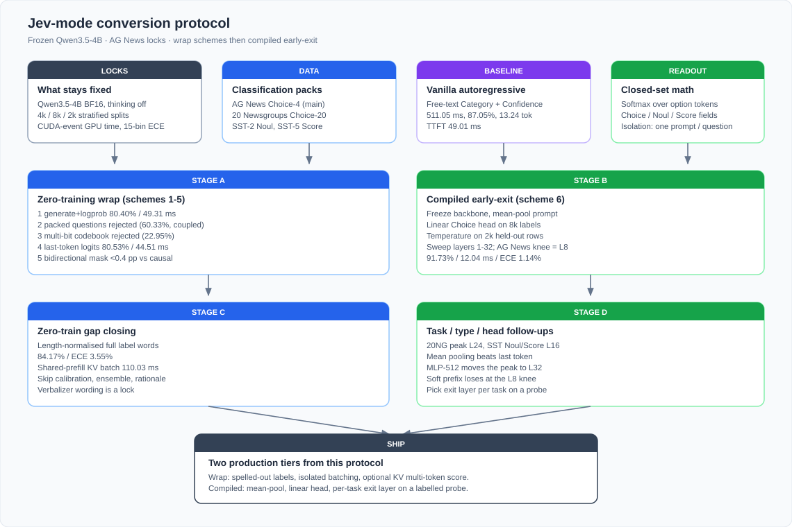

# Jev-mode conversion protocol

## Aim

This work seeks to convert a frozen instruct decoder into Jev-mode prediction
(`Choice` / `Noul` / `Score`), measure wrap-time generate+logprob against a
compiled single-forward predictor, and lock which levers keep classification
quality on a convenient short-text mix.

The model under conversion for the closed primary run is **Qwen3.5-4B**.
The same stages were re-run on **Qwen3.8-27B** and **DeepSeek-V4.1-Flash**.
Cross-model summary: [`REPORT.md`](REPORT.md). Per decoder:
[`REPORT_qwen35_4b.md`](REPORT_qwen35_4b.md),
[`REPORT_qwen38_27b.md`](REPORT_qwen38_27b.md),
[`REPORT_deepseek_v41_flash.md`](REPORT_deepseek_v41_flash.md).

Out of scope: long-context routing, multilingual packs, multi-step reasoning,
serving stacks, product library code.



*Figure: locked comparison first; Stage A is zero-training wrap; Stage B is the
compiled conversion; Stages C–D close remaining questions; SHIP is the two-tier
recommendation.*

## Status

**Closed** on Qwen3.5-4B, Qwen3.8-27B, and DeepSeek-V4.1-Flash (same stage
order; Flash uses TP8). Artifacts in [`results/`](results/). Hub scorecard:
[`REPORT.md`](REPORT.md).

Qwen3.8-27B note: soft-prefix **exit layer 64** used `train_per_class=500`
(other prefix exits used 2000); see [REPORT_qwen38_27b.md](REPORT_qwen38_27b.md).

## 1. Locks

Do not change these between arms of one run. A changed lock is a different
comparison.

| Lock | Value |
| --- | --- |
| Decoder | Qwen3.5-4B, BF16, `trust_remote_code=True` |
| Thinking | `enable_thinking=False` in `apply_chat_template` |
| Padding | tokenizer `padding_side="left"`; pad = EOS if missing |
| Input cap | 256 tokens |
| Seed | `20260920` (`stratified_subset` / `stratified_disjoint`) |
| Quality | accuracy, NLL, multiclass Brier, 15-bin ECE |
| Score extra | ordinal MAE on SST-5 |
| Speed | CUDA-event GPU compute after warmup; tokenization excluded |
| Latency probe | ≥20 warmups; report p50 of the steady window |
| Hardware | one Hopper GPU (96GB HBM) per arm |
| Runtime | PyTorch 2.11/cu129, Transformers 5.9 |

Closed-set probabilities are a softmax over the option-token logits of **that
question only**. Multi-question calls are N isolated prompts that share state
text and nothing else.

### Splits (AG News, main pack)

| Split | n | Rule |
| --- | --- | --- |
| Test | 4,000 | 1,000 per class, stratified |
| Head train | 8,000 | 2,000 per class, disjoint from calibration |
| Temperature | 2,000 | 500 per class, from remaining train |

AG News CSV rows are 1-indexed labels; `read_ag_news` stores `label - 1`.
Class names in order: World, Sports, Business, Sci/Tech.

### Follow-up packs

| Pack | Type | Classes | Script |
| --- | --- | --- | --- |
| AG News | Choice | 4 | original CSV |
| 20 Newsgroups | Choice | 20 | [`prepare_followup_data.py`](prepare_followup_data.py) |
| SST-2 | Noul | 2 | same |
| SST-5 | Score | 5 | same |

Per-task train / calibration / test counts follow `auto_split` in
[`benchmark_followups.py`](benchmark_followups.py) when CLI per-class flags
are left at 0.

## 2. Stage order

Run stages in this order. Later stages consume the vanilla 511.05 ms / 87.05%
anchor. Skip Stage C if the only question is compiled early-exit.

| Stage | Question | Script | Labels used |
| --- | --- | --- | --- |
| 0 | Environment | GPU free + model load smoke | no |
| 1 | Vanilla AR + verbalizer | [`benchmark_vanilla.py`](benchmark_vanilla.py) | no |
| 2 | Wrap schemes 1–4 | [`benchmark_zero_shot.py`](benchmark_zero_shot.py), [`benchmark_packed.py`](benchmark_packed.py) | no |
| 3 | Compiled depth sweep | [`benchmark_layer_prune.py`](benchmark_layer_prune.py) | yes |
| 4 | Task / type / MLP / prefix | [`benchmark_followups.py`](benchmark_followups.py) | yes |
| 5 | Zero-train gap | [`benchmark_zero_train.py`](benchmark_zero_train.py) | no |
| 6 | Shared-prefill KV scoring | [`benchmark_kv_score.py`](benchmark_kv_score.py) | no |
| 7 | Figures + summary | `render_*.py` | — |

Scheme 5 (bidirectional mask) is the mask control inside Stage 3, on the same
frozen weights as the depth sweep.

## 3. Stage 0 — environment

1. Confirm the GPU is empty (`memory.used` near 0, no zombie compute PIDs).
2. Load tokenizer + model once; disable thinking; set left padding.
3. Point `--model` at a local instruct checkpoint. Point CSVs at the AG News
   train/test files used by `read_ag_news`.

## 4. Stage 1 — vanilla baseline

Prompt: two-line free text, `Category:` then `Confidence:`.

Measure:

- full-answer generate (this run: mean 13.24 tokens)
- TTFT (first generated token)
- prefill-only
- closed-set last-token readout over spelled-out class names **and** `A`–`D`

Closed-set aliases that must be a single tokenizer id use
`alias_token_ids(..., leading_space=False)`. `Sci/Tech` truncated to `Sci` is
the single-token word arm.

**Closed numbers:** 87.05%, 511.05 ms batch-1, TTFT 49.01 ms. Word verbalizer
83.17%; letter verbalizer 80.53%. Every later speedup is against 511.05 ms.

## 5. Stage 2 — wrap schemes (zero training)

| # | Arm | How | Pass / fail on this run |
| ---: | --- | --- | --- |
| 1 | Generate one token + logprob | Isolated `A`–`D` generate | 80.40%, 49.31 ms, 10.36× |
| 2 | Pack several questions | One prefill, four answer tokens | **Fail.** 60.33% topic accuracy; slower than an independent batch of four |
| 3 | Multi-bit codebook | 16 symbols = class × confidence bin | **Fail.** 22.95%, ECE 28.25% |
| 4 | Direct last logits | Prefill, softmax over aliases, no sample | 80.53%, 44.51 ms, 11.48× |
| 5 | BERT-style prefill | Causal vs bidirectional mask at matched depth | Mask applied (hidden max abs 42.4); accuracy moves ≤0.4 pp. Keep causal |

Isolation rule for scheme 2: if later answers flip when earlier answer tokens
are visible, the packed form is out of the Jev-compatible path.

## 6. Stage 3 — compiled conversion

Freeze the backbone. For each exit layer in
`1,2,4,6,8,12,16,24,32`:

1. Forward with `output_hidden_states=True`, `use_cache=False`.
2. Mean-pool real tokens of the prompt (73 tokens on the AG News native prompt).
3. Fit `LogisticRegression` on the 8,000-row train split.
4. Fit one temperature on the 2,000-row calibration split (`fit_temperature`).
5. Score the 4,000-row test split.
6. Time a batch-1 and batch-32 forward that stops at that layer.

Controls on the same features:

- last-token pooling vs mean pooling
- causal mask vs 4D bidirectional mask

**Closed AG News knee:** layer 8, 91.73%, 12.04 ms, ECE 1.14%, 42.5× vs vanilla.
Layer 32 is 89.55% / 45.51 ms: extra depth is spent on next-token prediction.

Native prompt for this stage: `News article:\n{text}` (no letter legend).

## 7. Stage 4 — follow-ups

Same frozen model, mean pooling, temperature-calibrated linear head, layer
grid as Stage 3.

| Job | `--job` | `--task` | What to record |
| --- | --- | --- | --- |
| Depth transfer | `depth` | `20newsgroups` / `sst2` / `sst5` | peak layer, layer-8 accuracy, first layer within 1 pp of peak; MAE on SST-5 |
| MLP head | `mlp` | `agnews` | peak layer of linear vs 512-d GELU MLP |
| Learned prefix | `prefix` | `agnews` | prefix length 4 / 8 / 16, 2 epochs, backbone frozen |

**Closed knees:** AG News L8, 20 Newsgroups L24, SST-2 / SST-5 L16. MLP peaks
at L32. Prefix loses at the L8 operating point. Pick the exit layer **per
task** on a labelled probe; the probe is the same forward used to train the
head.

## 8. Stage 5 — zero-train gap closing

No labels anywhere in [`benchmark_zero_train.py`](benchmark_zero_train.py).

Arms, all against the Stage 1 word verbalizer (83.17%, ECE 11.79%):

| Arm | How | Closed result |
| --- | --- | --- |
| Full label words, summed logprob | teacher-force `World`…`Sci/Tech` | 83.17%, ECE 11.79% |
| Full label words, length-normalised | divide by token count, then softmax | **84.17%, ECE 3.55%** |
| Descriptive paraphrases | e.g. `Science and Technology` | 59.15% — wording is a lock |
| Contextual calibration | divide by content-free prior (`N/A`, `""`, `[MASK]`) | 77.80% — skip |
| 16-form ensemble | log-sum-exp over surface forms | 84.25% / 731.64 ms — skip |
| Short rationale then readout | generate up to k tokens, stop at EOS, then closed-set | 82.10% at k=8 / 312.74 ms — skip |

Let generation stop at EOS. Forcing `min_new_tokens` fills the tail with junk
and invalidates the arm.

## 9. Stage 6 — shared-prefill KV scoring

Naive Stage-5 scoring re-runs the prompt for every candidate. Candidates share
the prompt, so one prefill plus teacher-forced tails is the production path.

[`benchmark_kv_score.py`](benchmark_kv_score.py):

1. Prefill once (`use_cache=True`).
2. Expand the cache on the batch axis to the number of candidates (Qwen3.5
   mixes full-attention and linear-attention layers; clone with `deepcopy`,
   then `repeat_interleave` on `keys` / `values` / `conv_states` /
   `recurrent_states`).
3. Score length-normalised logprob of each tail.
4. Check argmax agreement with the naive four-pass scorer (this run: 64/64).
5. Time naive / sequential-KV / batched-KV / prefill-only.

**Closed latency (batch 1):** naive 178.93 ms; sequential KV 237.25 ms
(deepcopy tax); batched KV **110.03 ms**; prefill 48.09 ms. `Sci/Tech` is three
tokens, so the batch path pays two extra decode steps. That path is 1.63× the
naive four-pass cost and 2.47× the single-token 44.51 ms arm.

## 10. Decision after a closed run

| Condition | Ship |
| --- | --- |
| No labels, lowest latency | Stage 2 last-token readout over spelled-out **single-token** names. Isolated batching. 83.17%, 44.51 ms, 11.5× |
| No labels, better ECE | Stage 5 length-normalised full words + Stage 6 batched KV. 84.17%, ECE 3.55%, 110.03 ms, 4.65× |
| Labels available | Stage 3 mean-pool linear head, exit layer from the Stage 4 probe. AG News: L8, 91.73%, 12.04 ms, 42.5× |

Default verbalizer: spelled-out class names. Letter aliases are a fallback
when an option has no natural word. Packed multi-question generate, zero-shot
codebooks, contextual calibration, verbalizer ensembles, generated rationales,
and bidirectional masks stay out of the shipping path on this evidence.

## 11. Commands

Replace `$MODEL` and `$DATA`. Scripts live in this directory. Use the same
Python that has torch 2.11 + transformers 5.9.

```bash
python3 benchmark_vanilla.py \
  --model "$MODEL" --test-csv "$DATA/ag_news/test.csv" \
  --output results/formal_vanilla.json

python3 benchmark_zero_shot.py \
  --model "$MODEL" --test-csv "$DATA/ag_news/test.csv" \
  --output results/formal_zero.json

python3 benchmark_packed.py \
  --model "$MODEL" --test-csv "$DATA/ag_news/test.csv" \
  --output results/formal_packed.json

python3 benchmark_layer_prune.py \
  --model "$MODEL" \
  --train-csv "$DATA/ag_news/train.csv" \
  --test-csv "$DATA/ag_news/test.csv" \
  --layers 1,2,4,6,8,12,16,24,32 \
  --output results/formal_prune.json

python3 prepare_followup_data.py   # writes SST / 20NG CSVs

python3 benchmark_followups.py --job depth --task 20newsgroups \
  --model "$MODEL" --train-csv "$DATA/20newsgroups/train.csv" \
  --test-csv "$DATA/20newsgroups/test.csv" --output results/formal_20ng.json

python3 benchmark_followups.py --job depth --task sst2 \
  --model "$MODEL" --train-csv "$DATA/sst2/train.csv" \
  --test-csv "$DATA/sst2/test.csv" --output results/formal_sst2.json

python3 benchmark_followups.py --job depth --task sst5 \
  --model "$MODEL" --train-csv "$DATA/sst5/train.csv" \
  --test-csv "$DATA/sst5/test.csv" --output results/formal_sst5.json

python3 benchmark_followups.py --job mlp --task agnews \
  --model "$MODEL" --train-csv "$DATA/ag_news/train.csv" \
  --test-csv "$DATA/ag_news/test.csv" --output results/formal_mlp.json

python3 benchmark_followups.py --job prefix --task agnews \
  --model "$MODEL" --train-csv "$DATA/ag_news/train.csv" \
  --test-csv "$DATA/ag_news/test.csv" --output results/formal_prefix.json

python3 benchmark_zero_train.py \
  --model "$MODEL" --test-csv "$DATA/ag_news/test.csv" \
  --out results/zero_train.json --per-class 1000

python3 benchmark_kv_score.py \
  --model "$MODEL" --test-csv "$DATA/ag_news/test.csv" \
  --out results/kv_score.json --agree-n 64

python3 render_results.py
python3 render_depth.py
python3 render_followups.py
python3 render_zero_train.py
python3 render_protocol.py
```

## 12. Artifacts

| Path | Role |
| --- | --- |
| [`results/summary.json`](results/summary.json) | Sanitized closed numbers |
| [`REPORT.md`](REPORT.md) | Cross-model hub |
| [`REPORT_qwen35_4b.md`](REPORT_qwen35_4b.md) | Qwen3.5-4B scorecard |
| [`REPORT_qwen38_27b.md`](REPORT_qwen38_27b.md) | Qwen3.8-27B scorecard |
| [`REPORT_deepseek_v41_flash.md`](REPORT_deepseek_v41_flash.md) | DeepSeek-V4.1-Flash scorecard |
| [`figures/protocol.svg`](figures/protocol.svg) | This protocol’s flowchart |
| [`figures/results.svg`](figures/results.svg) | Vanilla vs wrap vs L8 |
| [`figures/depth_sweep.svg`](figures/depth_sweep.svg) | Exit-layer frontier |
| [`figures/followups.svg`](figures/followups.svg) | Task / MLP / prefix |
| [`figures/zero_train.svg`](figures/zero_train.svg) | Zero-train arms |
| [`common.py`](common.py) | Splits, prompts, metrics, CUDA timing |
