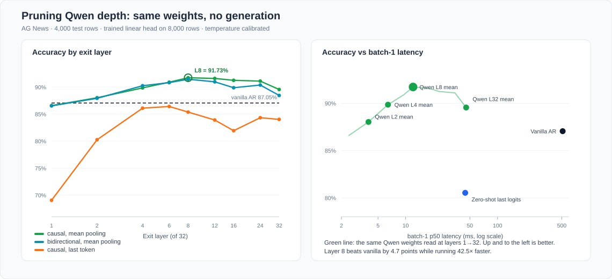
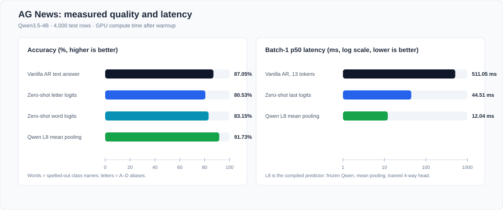
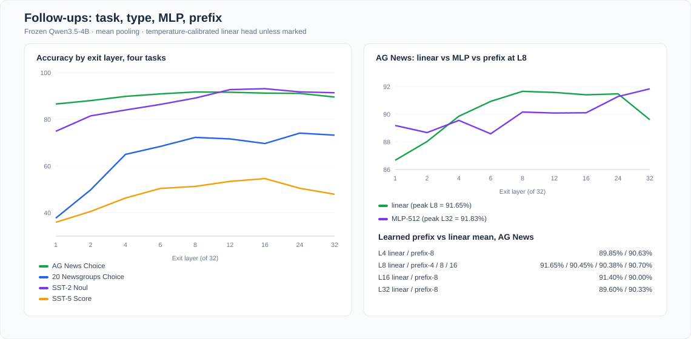

# Jev-Mode Benchmark — Qwen3.5-4B

## Aim

This work seeks to measure how much latency jev-any-llm can remove when a normal
autoregressive LLM is used as a typed predictor, and which architectural changes
preserve AG News classification quality.

This report is the **Qwen3.5-4B** scorecard. Cross-model summary:
[REPORT.md](REPORT.md). Same protocol on other decoders:
[Qwen3.8-27B](REPORT_qwen38_27b.md), [DeepSeek-V4.1-Flash](REPORT_deepseek_v41_flash.md).

## Headline result

**Qwen read at layer 8 with mean pooling is 42.5× faster than vanilla Qwen and
4.7 points more accurate, on the same weights.** Vanilla Qwen3.5-4B writing a
text answer takes 511.05 ms per request and scores 87.05%. Exiting the same
model after 8 of its 32 layers, mean-pooling the hidden states and reading a
trained 4-way head takes 12.04 ms and scores 91.73%, with 1.14% ECE.

Two design choices carry that result:

- **Mean pooling over the prompt.** At layer 32 the difference versus last-token
  pooling is 89.55% versus 84.03%. Last-token pooling asks a causal model to
  summarise the article in one position it was never trained to summarise into.
- **Exit early.** Accuracy peaks at layer 8 and *decreases* to layer 32. The
  deep layers specialise in next-token prediction, which is the wrong job for
  this classifier.

Removing the causal mask does not help: with bidirectional attention layer 8
scores 91.45% against 91.73% causal. The mask change is real — hidden states
differ by up to 42.4 in absolute value — it simply buys nothing here, so the
conversion does not need it.

*Figure: left, accuracy by exit layer for three readout variants against the
vanilla text baseline. Right, the accuracy/latency frontier; up and to the left
is better. The green curve is one set of Qwen weights read at different depths.*

The trained arms use 8,000 labelled rows, so they are not zero-shot. Against
the zero-shot arms the ranking is different: one forward pass over the full
model reaches 80.53% with no training at all, and 11.5× the vanilla speed.

*Figure: accuracy uses 4,000 balanced AG News test rows. Latency is GPU compute
time after warmup. All bars are Qwen3.5-4B.*

## Locked protocol

| Item | Value |
| --- | --- |
| Dataset | AG News |
| Test | 4,000 rows, stratified (1,000 per class) |
| Head training | 8,000 rows, stratified |
| Temperature calibration | disjoint 2,000 rows from train |
| Decoder | Qwen3.5-4B, BF16 |
| Input cap | 256 tokens |
| Hardware | Hopper (96GB HBM); each arm uses one GPU |
| Runtime | PyTorch 2.11/cu129, Transformers 5.9 |
| Quality | accuracy, NLL, multiclass Brier, 15-bin ECE |
| Speed | CUDA-event GPU time; CPU tokenization excluded; 20 warmups |

The decoder’s thinking mode is disabled. Choice aliases are single tokens
`A`–`D`. Probabilities are a 4-way softmax over those alias logits.

The full stage order, splits, commands, and ship rules are in
[PROTOCOL.md](PROTOCOL.md).

## Results by proposal

All six proposed routes were measured. The table maps each one to its verdict;
sections below give the numbers.

| # | Proposal | Measured | Verdict |
| ---: | --- | --- | --- |
| 1 | Same pattern, generate one token + logprob | 80.40%, 49.31 ms, 10.36× | Works; the predicted "same speed" is wrong — dropping 13 serial decode steps is already a 10× win |
| 2 | Pack several questions behind one prefill | 145.12 ms vs 52.47 ms for an independent batch of 4; topic accuracy 80.53% → 60.33% | **Rejected.** Slower than plain batching and it couples the answers |
| 3 | One-token multi-bit class+confidence code | 22.95%, ECE 28.25% | **Rejected** zero-shot. An arbitrary codebook is near chance and its legend lengthens prefill |
| 4 | Direct logits after prefill | 80.53%, 44.51 ms, 11.48× | Works, but only 1.11× over #1 — 97.9% of the cost is prefill itself |
| 5 | Make prefill non-autoregressive, BERT-style | Bidirectional mask moves accuracy by ≤0.4 pt (L8: 91.45% vs 91.73%) | **Premise does not hold.** Causal prefill is *already* one parallel pass over all prompt tokens; removing the mask buys nothing |
| 6 | Fine-tune into a non-autoregressive predictor | 91.73%, 12.04 ms, 42.5× | **Winner.** Frozen backbone, layer-8 mean pooling, linear typed head |

The one lever not on the original list turned out to be the decisive one:
**exit depth**. It is what separates #6's 12.04 ms from #4's 44.51 ms; both read
the same frozen weights.

### 0. Vanilla autoregressive baseline

This is stock Qwen3.5-4B with no jev-any-llm machinery: the prompt asks for a category
and a numeric confidence, and the model writes them as text.

| Accuracy | Mean output tokens | Batch-1 p50 | Batch-1 TTFT | Batch-32 p50 | Batch-32 throughput |
| ---: | ---: | ---: | ---: | ---: | ---: |
| **87.05%** | 13.24 | **511.05 ms** | 49.01 ms | 825.85 ms | 37.93 examples/s |

This is the reference for both quality and speed; every speedup below is quoted
against it. The split between 511.05 ms and a 49.01 ms first token shows where
the cost sits: prefill is paid once, then each additional token costs roughly
29 ms of serial decode.

Free-text answers carry no usable probability, so calibration metrics require
the closed-set arms below.

### 0b. Where the accuracy gap comes from

Schemes 1 and 4 read a closed set of `A`–`D` aliases and land near 80.5%,
6.5 points under the text baseline. Running the same closed-set readout over
the spelled-out class names separates the two candidate causes.

| Readout | Verbalizer | Accuracy | ECE | Greedy token inside the closed set |
| --- | --- | ---: | ---: | ---: |
| Free text | `Category: Sports` | **87.05%** | — | — |
| One forward | `World`/`Sports`/`Business`/`Sci` | 83.15% | 11.80% | 98.88% |
| One forward | `A`/`B`/`C`/`D` | 80.53% | 9.98% | 99.78% |

The two closed-set readouts agree on 93.28% of rows. Switching from letters to
class names recovers 2.6 of the 6.5 points at identical cost, so most of the gap
is the letter indirection rather than the probability readout. The remaining
3.9 points are what the model gains from writing an answer in its own format.
jev-any-llm should therefore default to spelled-out label words and treat letter aliases
as a fallback for options that have no natural name.

### 1. Same prediction pattern: generate one token + logprob

| Accuracy | Brier | ECE | Batch-1 p50 | Batch-32 throughput |
| ---: | ---: | ---: | ---: | ---: |
| 80.40% | 0.3069 | 9.98% | 49.31 ms | 76.82 examples/s |

Effect versus vanilla: **10.36× at batch 1** (511.05 → 49.31 ms) and **2.03×
batch-32 throughput**. The batch-1 figure is the one users feel; the throughput
figure is smaller because a batch of 32 already amortises decode. The quality
gap is 6.65 percentage points, attributed above to the letter verbalizer.

### 2. Put several questions behind one prefill

Four judgments are evaluated for each article: topic plus three binary topic
checks.

| Execution | Batch-1 time for four judgments | Contract |
| --- | ---: | --- |
| Four sequential prefills | 177.94 ms | isolated |
| Four independent prompts in one batch | **52.47 ms** | isolated |
| One prefill + four autoregressive answer tokens | 145.12 ms | causally coupled |

Packed generation is 1.23× faster than four sequential calls, but **2.77×
slower than an independent batch of four**. It also changes the task:

- topic accuracy falls from 80.53% to 60.33%;
- per-question argmax flip rates are 41.70%, 81.38%, 31.90%, and 85.35%;
- later answers condition on earlier answer tokens.

Decision: use independent batching / prefix caching. The causally packed form
is excluded from the Jev-compatible path.

### 3. One-token multi-bit class + confidence code

The zero-shot codebook contains 16 symbols: 4 classes × 4 confidence bins.

| Accuracy | Brier | ECE | Batch-32 throughput |
| ---: | ---: | ---: | ---: |
| **22.95%** | 0.9262 | 28.25% | 61.31 examples/s |

The arbitrary codebook is below chance-adjacent quality and slower than the
4-code readout because its legend lengthens prefill. This route needs codebook
training; prompt-only bit packing is rejected.

### 4. Direct logits after prefill

| Accuracy | Brier | ECE | Batch-1 p50 | Batch-32 p50 |
| ---: | ---: | ---: | ---: | ---: |
| 80.53% | 0.3067 | 9.98% | **44.51 ms** | **427.29 ms** |

Versus vanilla this is **11.48× at batch 1**. Versus one-token `generate` it is
only 1.11× at batch 1 and 1.01× at batch 32. Argmax agreement with scheme 1 is
99.775%; mean absolute probability difference is 0.00196 in BF16.

This is the floor for unmodified Qwen. A pure prefill of the same prompt costs
43.56 ms, so 97.9% of the 44.51 ms is the backbone reading the prompt.
Removing sampling and generation plumbing saves the rest.

### 5. Non-autoregressive prefill, BERT-style

This proposal assumed prefill is autoregressive and could be parallelised. It
is not: a causal LLM already runs **every prompt position in one parallel pass
per layer**. The 43.56 ms prefill measured in scheme 4 is that single pass, and
no token in it waits for another. There is no serial cost to remove.

What remains testable is whether the *causal mask* costs accuracy. A 4D mask
letting every real token attend both ways changes the hidden states
substantially — max absolute difference 42.4, confirming it is applied — and
moves accuracy by at most 0.4 points, in either direction:

| Exit layer | Causal | Bidirectional |
| ---: | ---: | ---: |
| 4 | 89.85% | 90.25% |
| 8 | **91.73%** | 91.45% |
| 32 | 89.55% | 88.45% |

So the conversion keeps the causal mask and stays compatible with stock
inference kernels, KV caching, and prefix caching. Reading the prompt in
parallel is not the lever; reading **fewer layers** of it is, which is scheme 6.

### 6. Depth-pruned Qwen: the conversion

This arm freezes Qwen3.5-4B, sweeps the exit layer, mean-pools the prompt, and
trains a 4-way linear Choice head on 8,000 labelled rows. A disjoint 2,000-row
split fits one temperature. The prompt is 73 tokens.

| Exit layer | Accuracy | Brier | ECE | Batch-1 p50 | Batch-32 throughput | Speedup vs vanilla |
| ---: | ---: | ---: | ---: | ---: | ---: | ---: |
| 1 | 86.58% | 0.2085 | 2.52% | 2.39 ms | 5,644 ex/s | 214.0× |
| 2 | 88.03% | 0.1868 | 2.80% | 3.94 ms | 3,024 ex/s | 129.7× |
| 4 | 89.85% | 0.1502 | 1.93% | 6.42 ms | 1,575 ex/s | 79.6× |
| 6 | 90.90% | 0.1399 | 1.33% | 9.55 ms | 1,061 ex/s | 53.5× |
| **8** | **91.73%** | **0.1292** | **1.14%** | **12.04 ms** | **802 ex/s** | **42.5×** |
| 12 | 91.60% | 0.1326 | 1.44% | 17.61 ms | 538 ex/s | 29.0× |
| 16 | 91.25% | 0.1361 | 1.24% | 23.13 ms | 405 ex/s | 22.1× |
| 24 | 91.10% | 0.1393 | 1.73% | 34.35 ms | 271 ex/s | 14.9× |
| 32 | 89.55% | 0.1591 | 1.64% | 45.51 ms | 203 ex/s | 11.2× |

Every row beats the 87.05% vanilla baseline except layer 1, and every row is
faster. Layer 8 is the knee: it is the accuracy maximum and still 3.8× faster
than reading the full stack.

Three findings sit behind the table.

**Pooling matters more than depth.** Mean pooling beats last-token pooling at
every depth, by 5.5 points at layer 32 and 17.5 points at layer 1:

| Exit layer | Mean pooling | Last token | Gap |
| ---: | ---: | ---: | ---: |
| 1 | 86.58% | 69.05% | 17.53 |
| 8 | 91.73% | 85.38% | 6.35 |
| 32 | 89.55% | 84.03% | 5.52 |

**Depth past 8 layers is spent on generation, not classification.** Accuracy
falls 2.2 points from layer 8 to layer 32 while latency grows 3.8×. The fitted
temperature tells the same story: it climbs from 0.89 at layer 8 to 3.89 at
layer 32, so the deep features produce increasingly overconfident logits that
calibration has to damp.

**Causal attention is sufficient**, as measured in scheme 5 above: dropping the
mask moves layer-8 accuracy from 91.73% to 91.45%.

## Follow-ups: task, type, MLP, prefix

All four remaining questions were measured on the same frozen Qwen3.5-4B,
mean pooling, and temperature-calibrated heads.

*Figure: left, accuracy by exit layer for Choice / Noul / Score. Right, MLP
versus linear on AG News, with learned-prefix numbers at matched depth.*

### The knee moves with the task

| Task | Type | Classes | Peak layer | Peak | Layer 8 | First layer within 1 pp of peak |
| --- | --- | ---: | ---: | ---: | ---: | ---: |
| AG News | Choice | 4 | **8** | 91.73% | 91.73% | 6 |
| 20 Newsgroups | Choice | 20 | **24** | 74.10% | 72.25% | 24 |
| SST-2 | Noul | 2 | **16** | 93.12% | 89.12% | 12 |
| SST-5 | Score | 5 | **16** | 54.64% | 51.28% | 16 |

AG News is the easy 4-way case: the stack is done by layer 8. A 20-way
newsgroup classifier keeps climbing until layer 24. Noul and Score, on SST,
share a later knee than AG News Choice — both peak at layer 16. Typed heads
therefore use one backbone and **per-task exit depth**, not a single global
layer-8 cut.

SST-5 also reports ordinal MAE. It tracks the accuracy knee: 0.641 at layer 8,
**0.557 at layer 16**, 0.661 at layer 32.

### An MLP head spends its gain on the full stack

On the matched AG News split, a 512-d GELU MLP peaks at **layer 32 (91.83%)**.
The linear head on the same features still peaks at **layer 8 (91.65%)**. At
the recommended early exit, MLP is behind: 90.15% versus 91.65%. The extra
nonlinearity spends capacity on the generation layers instead of moving the
operating point earlier.

### Mean pooling still wins at the layer-8 operating point

Soft prefixes of length 4 / 8 / 16 were trained for 2 epochs with the backbone
frozen. Linear mean pooling at the same split is the reference.

| Exit | Linear mean | Prefix-8 | Δ |
| ---: | ---: | ---: | ---: |
| 4 | 89.85% | 90.63% | +0.78 |
| 8 | 91.65% | 90.38% | −1.27 |
| 16 | 91.40% | 90.00% | −1.40 |
| 32 | 89.60% | 90.33% | +0.73 |

At layer 8, prefix-4 scores 90.45% and prefix-16 scores 90.70% — both below
the prefix-free linear head. The only clear gain is at layer 4, where the
features are still thin. Latency at layer 8 with a 16-token prefix is 11.91 ms
versus 12.04 ms without it, so the extra tokens are in the noise; they do not
buy accuracy either.

## Closing the gap without labels

The compiled tier needs 8,000 labelled rows. This section asks how far the
zero-training tier can be pushed instead. Nothing below touches a label; the
content-free priors are estimated from three dummy inputs.

| Arm | Accuracy | ECE | Batch-1 p50 |
| --- | ---: | ---: | ---: |
| Vanilla free text (reference) | **87.05%** | — | 511.05 ms |
| Single-token words (current zero-shot arm) | 83.17% | 11.79% | 44.51 ms |
| Full label words, summed logprob | 83.17% | 11.79% | 178.93 ms naive |
| **Full label words, length-normalised** | **84.17%** | **3.55%** | **110.03 ms KV-batched** / 178.93 ms naive |
| Descriptive label words, length-normalised | 59.15% | 32.52% | 178.93 ms naive |
| Verbalizer ensemble, 16 surface forms | 84.25% | 3.88% | 731.64 ms |
| Contextual calibration on single-token | 77.80% | 14.39% | 44.51 ms |
| Contextual calibration on full words | 77.15% | 13.72% | 178.93 ms naive |
| Rationale, 8 tokens then readout | 82.10% | 11.12% | 312.74 ms |
| Rationale, 16 tokens then readout | 77.18% | 16.35% | 316.09 ms |
| Rationale, 32 tokens then readout | 76.48% | 16.32% | 316.15 ms |

*Figure: accuracy left, calibration error right, both for the same 4,000 rows.
The compiled head is shown only for scale; it is the one arm that uses labels.*

**Length normalisation is the only lever that pays.** Scoring the full
`Sci/Tech` instead of its truncated first token, and dividing by token count,
adds 1.0 point and cuts ECE by 3.3× — from 11.79% to 3.55%. Summing without
normalising reproduces the single-token number exactly, because all four label
words start with distinct tokens; the gain comes from the continuation
likelihood, not from the first token.

**Label wording dominates everything else.** Swapping `World`/`Sci/Tech` for
`World News`/`Science and Technology` costs 25 points. A zero-training wrapper
must treat the verbalizer as a tuned artifact, not a cosmetic string.

**Contextual calibration is harmful here**, by 5–7 points in all three places
it was applied. The content-free prior is extremely skewed —
`[0.526, 0.012, 0.025, 0.437]` over World/Sports/Business/Sci/Tech — so dividing
by it suppresses exactly the two classes the model is most often right about.
The technique assumes a mild prior; this prompt does not produce one.

**Verbalizer ensembling is not worth its cost.** Sixteen surface forms buy
0.08 points over four (84.25% versus 84.17%) for 4× the passes, 731.64 ms.

**A generated rationale makes things worse and slower.** Even letting
generation stop at EOS, eight tokens of evidence cost 7× the latency and one
point of accuracy; longer budgets lose six more. Reading the closed set
directly beats letting the model talk first.

A caveat on cost: the four-pass arm was first measured as **178.93 ms** by
re-running the whole prompt for every candidate. A shared-prefill
implementation is now measured. One prefill (48.09 ms) plus a batch of four
teacher-forced tails costs **110.03 ms**. Sequential decode of the four
candidates is slower than naive, at 237.25 ms, because each tail clones a
hybrid cache. Argmax agreement with naive scores is 64/64 on a held-out
probe; `Sci/Tech` is three tokens (`[87569, 16240, 4584]`) and is what forces
the extra decode steps.

That is **1.63×** the naive four-pass cost and still **2.47×** the
single-token 44.51 ms arm. Qwen3.5's mixed linear-attention cache makes those
decode steps far from free, so KV sharing does not collapse the multi-token
verbalizer onto TTFT.

**The gap does not close.** The best zero-training arm reaches 84.17%, still
2.88 points under the free-text baseline and 7.56 under the compiled layer-8
head. What zero training *can* deliver is a usable probability: 3.55% ECE
against 11.79% for the current arm, versus 1.14% with labels.

## What this says about prefill

Causal LLM prefill already runs all prompt positions in parallel inside each
layer. It is a single forward pass with a causal mask. The autoregressive cost
begins after prefill.

Therefore:

1. Multi-token generation → one forward is the first large win: 11.5× at
   batch 1, 2.03× at batch 32, with no training.
2. One-token generation → direct logits is a small 1.01–1.11× framework win.
3. **Depth is the second large win, and the cut is task-specific.** Easy 4-way
   Choice on AG News peaks at layer 8. 20-way Choice peaks at layer 24. SST-2
   Noul and SST-5 Score peak at layer 16.
4. Independent batching and prefix *caching* remain wrap-path levers. A trained
   soft prefix, at the compiled layer-8 point, stays below mean-pooled linear
   features.

## Recommendation (this decoder)

1. **Zero-training wrap:** spelled-out label words; length-normalised full words
   + shared-prefill KV when calibration matters (84.17%, 3.55% ECE, 110.03 ms).
2. **Compiled predictor:** freeze the backbone, mean-pool, linear head, exit at
   **layer 8** on AG News Choice (91.73%, 12.04 ms, **42.5×**). Probe exit depth
   per task — 20-way Choice peaks later; SST Noul/Score peak at layer 16.

Hub recommendation across models: [REPORT.md](REPORT.md).

## Artifacts

Protocol: [PROTOCOL.md](PROTOCOL.md). Figures in [`figures/`](figures/).
Primary 4B JSON: [`results/summary.json`](results/summary.json).
